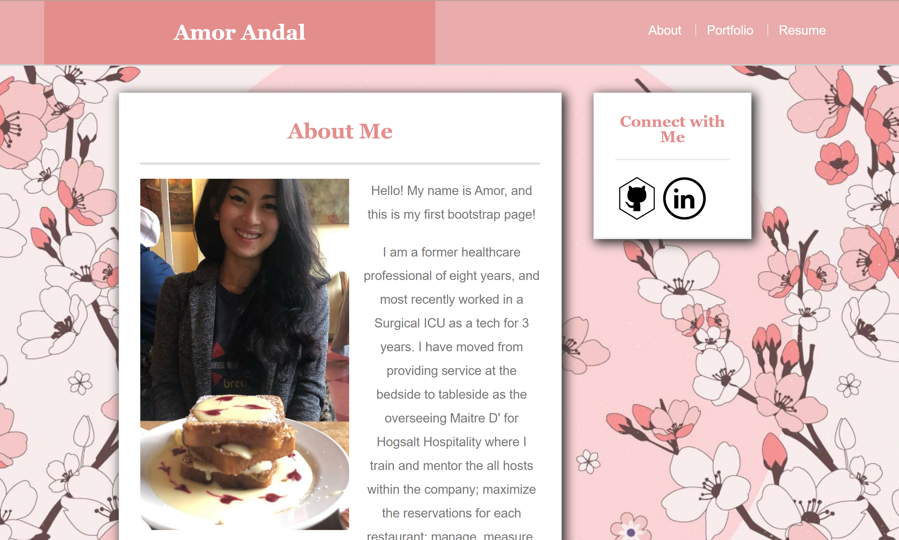
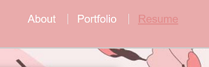
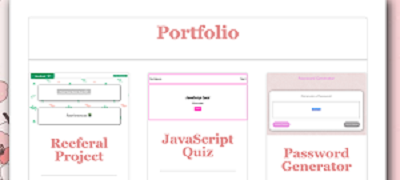

# Responsive-Portfolio
## Summary
This application launces my first Professional Page, where a summary about myself as well as past projects and my resume may be found.

## Features
* Check out the Portfolio page for links to my projects.
* Click on the appropriate links in the Navigation Bar to find desired page. 
* The resume may be downloaded by clicking on the image.

## Technologies Used
* HTML
* CSS
* JavaScript
* Bootstrap

## Links
[Amor Andal's Portfolio](https://andal-a.github.io/Responsive-Portfolio/)
